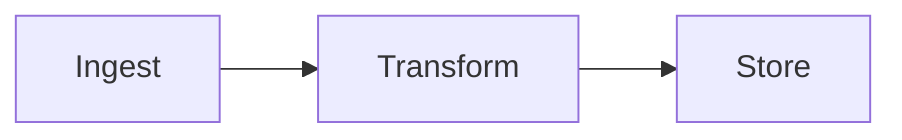

# md2html

Render agent-authored Markdown reports into **vibrant, self-contained HTML**.

Markdown stays the canonical artifact (agents write it, diff it, grep it);
HTML is a derived, human-facing render with:

- **Shiki** syntax highlighting (light/dark via CSS variables, one file)
- **KaTeX** math with fonts inlined (zero network requests for math)
- **Mermaid** diagrams, theme-aware re-render on toggle
- **XY** interactive charts ([reflex-dev/xy](https://github.com/reflex-dev/xy)) —
  pan/zoom/selection, embedded as theme-synced iframe variants
- GFM tables, alerts, task lists; auto TOC; light/dark theme toggle
- Output is a single `.html` file (+ `xy-out/` chart files when charts present)

## Install (any machine, any harness)

```bash
git clone https://github.com/gabenavarro/md2html
cd md2html
bash scripts/ensure-env.sh        # idempotent: node deps + .venv with xy
```

Requires Node ≥ 20 and Python ≥ 3.11 (or `uv`, which can provision Python).

## Usage

```bash
node bin/md2html.mjs report.md            # -> report.html
node bin/md2html.mjs reports/             # render every *.md in a directory
node bin/md2html.mjs report.md --out out.html --theme dark
```

The renderer is also usable as a library:

```js
import { render } from "md2html/lib/render.mjs";
const { html, outPath, xy, toc, meta } = await render("report.md");
```

## As an agent skill

This repo **is a skill**: `SKILL.md` at the root follows the
[Agent Skills](https://github.com/anthropics/skills) format (the same layout
Claude Code, OMP, Codex, and other harnesses discover).

**OMP** — `skills.customDirectories: ["/path/to/md2html"]` in your config, or
copy/symlink into `~/.agent/skills/` (user) / `.github/skills/` (project):

```bash
ln -s /path/to/md2html ~/.agent/skills/md2html   # OMP user-level
```

**Claude Code** — drop into a project's `.claude/skills/` or the user skills
directory, or register via the skills marketplace mechanism.

**Any harness** — the `SKILL.md` description + body is the contract; the
harness only needs to load that file into context. The renderer is a plain
Node CLI and the XY exporter a plain Python script — no harness-specific code.

For multi-section reports, the skill defines a
**subagent orchestration** pattern (architect → parallel section writers →
figure specialist → assembler → reviewer) — see
[`workflows/orchestration.md`](workflows/orchestration.md).

## Authoring a report

```markdown
---
title: Q3 Experiment Results
description: One-line summary.
date: 2026-09-20
author: OMP
meta:
  project: engram
  run: q3
---

# Q3 Experiment Results

## Summary

| Metric | A | B |
|--------|---|---|
| AUC    | .81 | .87 |

> [!NOTE]
> Provenance note.

## Architecture



## Throughput

```xy
import numpy as np
import xy
chart = xy.line_chart(
    xy.line([1, 2, 3], [10, 20, 15], color="#4f46e5", width=2.5),
    xy.x_axis(label="day"), xy.y_axis(label="seq/s"),
    title="tput",
)
```

$$\mathcal{L} = \sum_i y_i \log \hat{y}_i$$

```python
import numpy as np
```
```

Full feature reference: [`workflows/report-format.md`](workflows/report-format.md).
Worked example: [`examples/sample.md`](examples/sample.md).

## XY charts

` ```xy ` blocks are Python chart sources:

1. extracted to `xy-src/xy-<hash>.py` (stable hash of the source),
2. rendered by `scripts/xy-export.py` (via `xy`) to `xy-out/` — **light and
   dark standalone HTML per chart**,
3. embedded as iframes; the page's theme toggle swaps the iframe src.

Each chart also has an "open" link to the standalone interactive file.

## Layout

```
SKILL.md                 skill definition (harness entry point)
bin/md2html.mjs          CLI
lib/render.mjs           core renderer (unified pipeline)
lib/template.mjs         single-file HTML template (theme, mermaid, xy sync)
assets/report.css        report stylesheet (light/dark CSS variables)
scripts/ensure-env.sh    idempotent environment bootstrap
scripts/xy-export.py     XY source -> standalone HTML (manifest mode)
workflows/report-format.md   full formatting reference
workflows/orchestration.md   subagent orchestration pattern
examples/sample.md       reference report
test/render.test.mjs     node --test suite
```

## Development

```bash
npm test                 # 10 tests
node bin/md2html.mjs examples/sample.md
```

## License

MIT
