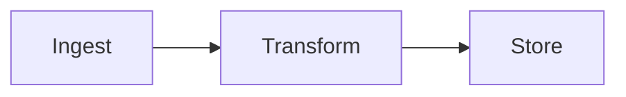

# md2html

Convert agent-authored Markdown reports into vibrant, self-contained HTML
reports with syntax highlighting, math, diagrams, and interactive charts.

## When to use

- User asks for an "HTML report", a "nice-looking" document, a dashboard,
  an analysis write-up, or any human-facing deliverable with code/math/diagrams.
- You are writing a report and the user previously asked for HTML output.
- The user wants a printable/shareable version of a Markdown analysis.

## Non-negotiables

1. **Markdown is the canonical artifact.** Always write/keep the `.md` file.
   HTML is derived — never hand-write the HTML report.
2. **Reproducible render.** The same `.md` must always produce the same HTML.
3. **Verify in a browser.** A render is not done until visually inspected.

## Setup (idempotent, run once per checkout)

```bash
bash <skill-dir>/scripts/ensure-env.sh
```

Requires Node >= 20 and Python >= 3.11 (or `uv`). Installs `npm` deps and an
isolated `.venv` with the [XY](https://github.com/reflex-dev/xy) charting
library. `xy` is a Rust-core Python library — charts export to standalone
interactive HTML.

## Authoring the report

Write a Markdown file with YAML frontmatter:

````markdown
---
title: Q3 Experiment Results
description: One-line summary (shown in <meta>).
date: 2026-09-20
author: OMP
toc: true
theme: auto          # auto | light | dark
meta:
  project: engram
  run: q3
---

# Q3 Experiment Results

## Summary

| Metric | A | B |
|--------|---|---|
| AUC    | .81 | .87 |

## Architecture



## Throughput

```xy
import xy
import numpy as np
chart = xy.line_chart(xy.line([1,2,3], [10,20,15]), title="tput")
```

$$
\mathcal{L} = \sum_i y_i \log \hat{y}_i
$$
````

Feature support (see `workflows/report-format.md` for full details):

- **Fenced code** — ` ```python `, ` ```bash `, etc. → Shiki, light/dark themes
- **Mermaid** — ` ```mermaid ` blocks → live diagrams, theme-aware
- **XY charts** — ` ```xy ` blocks → standalone interactive HTML (pan/zoom/
  selection), theme-synced via light/dark iframe variants
- **Math** — `$$ ... $$` blocks and `$...$` inline → KaTeX, fonts inlined
- **GFM** — tables, strikethrough, task lists, alerts (`> [!NOTE]`)
- **TOC** — auto-generated for documents with 3+ `##`/`###` headings

## Rendering

```bash
node <skill-dir>/bin/md2html.mjs <report.md>
# outputs <report>.html next to the .md (+ xy-out/ when XY charts present)
```

Flags: `--out path`, `--theme auto|light|dark`, `--python <path>`.
Directory argument renders every `*.md` in it.

## Subagent orchestration (high-quality reports)

For reports above ~200 lines, or any report with 3+ sections, use
**parallel subagent orchestration** — see `workflows/orchestration.md`.
The pattern: one agent drafts structure, parallel specialists write sections,
one owner assembles, one reviewer verifies. Quality gate: the report is not
done until a reviewer subagent has checked the rendered HTML.

## Quality bar

- Every figure has a caption/axis labels.
- Numbers are traceable to a source (state provenance in the report).
- Report reads well as Markdown *and* as HTML (tables aligned, headings hierarchical).
- Rendered output verified in a browser: light **and** dark theme.

## Files

- `bin/md2html.mjs` — CLI renderer
- `lib/render.mjs` — core pipeline (unified/remark/rehype)
- `lib/template.mjs` — single-file HTML template (theme toggle, mermaid, xy)
- `assets/report.css` — report stylesheet
- `scripts/ensure-env.sh` — idempotent environment bootstrap
- `scripts/xy-export.py` — XY chart source → standalone HTML (manifest mode)
- `workflows/report-format.md` — full formatting reference
- `workflows/orchestration.md` — subagent orchestration pattern
- `examples/sample.md` — reference report exercising every feature
