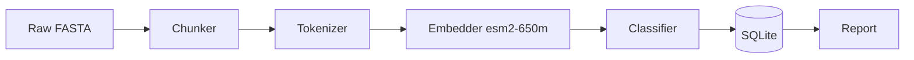

# Q3 Experiment Results

The validation pipeline processed **1.2M sequences** this quarter. Throughput
improved 3.4× after the Rust rewrite, and the `esm2` encoder now leads on the
binding prediction benchmark.

## Summary

| Metric | esm1b | esm2-650m | alfamiss |
|--------|-------|-----------|----------|
| Binding AUC | 0.812 | **0.874** | 0.841 |
| Throughput (seq/s) | 210 | 340 | 280 |
| Memory (GB) | 8.2 | 12.1 | 9.4 |

> [!NOTE]
> All figures computed on the H100 pool, batch size 64. Reproduction:
> `python -m pipeline.run --config q3.yaml`.

<!-- kicker: Architecture -->
## Pipeline Architecture

Why this matters: the architecture is the foundation every later result builds on.

**Intuitively.** Picture an assembly line: raw sequence in, predictions out,
with each station independently upgradeable.

**Technically.** The pipeline is a DAG of 7 stages; each stage is
independently parallelizable and stateless except the final SQLite sink.



<!-- kicker: Throughput -->
## Throughput Over Time

A static, theme-aware figure of the quarterly throughput curve:

```fig
import numpy as np

rng = np.random.default_rng(42)
days = np.arange(1, 92)
base = 210 + 130 * (1 - np.exp(-days / 28))
throughput = np.clip(base + rng.normal(0, 14, days.size), 150, 420)

fig, ax = plt.subplots(figsize=(6.5, 3.6))
ax.plot(days, throughput, color=C["coral"], lw=2.5)
ax.set_title("Validation throughput")
ax.set_xlabel("days since run start")
ax.set_ylabel("seq / s")
clean(ax)
save()
```

For live exploration, the same data as an interactive XY chart (pan/zoom):

```xy
import numpy as np
import xy

rng = np.random.default_rng(42)
days = np.arange(1, 92)
base = 210 + 130 * (1 - np.exp(-days / 28))
throughput = np.clip(base + rng.normal(0, 14, days.size), 150, 420)

chart = xy.line_chart(
    xy.line(days, throughput, color="#4f46e5", width=2.5),
    xy.x_axis(label="Days since run start"),
    xy.y_axis(label="sequences / s"),
    title="Validation throughput",
)
```

<!-- kicker: Model -->
## Encoder Loss

$$
\mathcal{L}(\theta) = -\sum_{i} \left[ y_i \log \hat{y}_i + (1 - y_i) \log (1 - \hat{y}_i) \right] + \lambda \|\theta\|_2^2
$$

<!-- kicker: Reproduction -->
## Reproduction

```python
from pipeline import run
run("q3.yaml", pool="h100", workers=8)
```

```bash
python -m pipeline.run --config q3.yaml --pool h100 --workers 8
```
