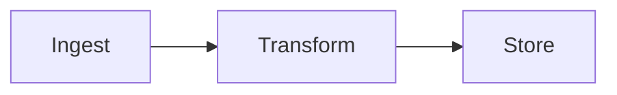

# md2html Report Format Reference

Full details on every feature the renderer supports. Write Markdown that
reads well *as Markdown* — HTML is derived, never hand-authored.

## Frontmatter

| Key | Type | Default | Notes |
|-----|------|---------|-------|
| `title` | string | filename | Report H1 (rendered in the hero) |
| `description` | string | `""` | `<meta description>`; hero lede fallback |
| `date` | string | today | Shown in footer |
| `author` | string | `""` | Rendered as a meta chip |
| `kicker` | string | `""` | Small-caps label above the hero title (e.g. `Engram · Q3 Validation`) |
| `theme` | `auto`\|`light`\|`dark` | `auto` | `auto` = follows viewer preference, toggle always available |
| `meta.*` | any | — | Rendered as chips under the hero (project, run, version, …) |

Everything under `meta:` becomes a chip. Keep chips short (project, run id,
dataset, version).
## Headings & layout

- `#` → report title, rendered once in the hero (the body H1 is dropped;
  prefer frontmatter `title`).
- `##`, `###` → section anchors (auto slugs, GitHub-style) and `toc` data
  on the returned object. The editorial theme is single-column: there is no
  sidebar TOC, so `toc:` frontmatter only affects the `toc` return value.
- `###` and deeper render fine; `##` starts a bordered section block.

## Editorial constructs

The editorial theme (default) adds a few authoring constructs:

**Hero lede.** The first paragraph before the first `##` becomes the hero
sub-title under the title. Keep it to 1–2 sentences.

**Section kicker.** An HTML comment directly above a `##` heading becomes a
numbered small-caps label ("01 · Architecture"):

```markdown
<!-- kicker: Architecture -->
## Pipeline Architecture
```

Kickers are numbered in document order. Omit the comment for unnumbered
sections.

**Intuitive / Technical panels.** A paragraph that starts with
`**Intuitively.**` or `**Technically.**` renders as a tinted two-line panel
(coral / teal). Use for the "why it matters" framing after a section opener:

```markdown
**Intuitively.** Picture an assembly line: raw data in, predictions out.

**Technically.** The pipeline is a DAG of 7 independently parallelizable stages.
```
## Tables (GFM)

```markdown
| Metric | A | B |
|--------|---|---|
| AUC    | .81 | .87 |
```

Pipe alignment, bold for winners, right-align numbers with `:---:`. Tables
render with zebra striping, sticky header on scroll, horizontal scroll on
narrow screens.

## Code blocks

Any GitHub language tag works. The Shiki highlighter loads 25 common
languages; unknown tags fall back to `plaintext` (rendered, never broken).
Supported out of the box: `python`, `bash`, `js`, `ts`, `json`, `yaml`,
`toml`, `sql`, `html`, `css`, `md`, `rust`, `go`, `java`, `c`, `cpp`,
`ruby`, `php`, `swift`, `kotlin`, `r`, `dockerfile`, `ini`, `diff`.

```python
import numpy as np
x = np.linspace(0, 10, 100)
```

Dual-theme: the same HTML works in light and dark; no duplication.

## Mermaid diagrams



All Mermaid v12 diagram types: flowchart, sequenceDiagram, classDiagram,
stateDiagram, erDiagram, gantt, pie, mindmap, timeline, journey, gitGraph.
Diagrams re-render on theme toggle (light: `default`, dark: `dark`).
The Mermaid bundle is inlined into the report at render time, so diagrams
work offline and from `file://` (no module scripts, no network).

The renderer gates every block at build time with `mermaid.parse`: invalid
diagrams fail the render with the parser's line-precise error (bypass with
`--no-check`) — a report can never ship a diagram that renders as an error.

Rules:
- Keep node labels short; long labels break layout.
- One diagram per fenced block; each gets its own card.
- No line breaks inside `[]`/`()`, use `<br/>` for multiline labels.

## XY charts (interactive)

```xy
import numpy as np
import xy

chart = xy.line_chart(
    xy.line([1, 2, 3, 4], [10, 20, 15, 30], color="#4f46e5", width=2.5),
    xy.x_axis(label="day"),
    xy.y_axis(label="seq/s"),
    title="Throughput",
)
```

How it works:
1. The block source is extracted to `xy-src/xy-<hash>.py` (stable hash of
   the source — identical code reuses files across renders).
2. `scripts/xy-export.py` renders it via `xy` (a Python library, Rust core)
   to standalone interactive HTML in `xy-out/` — **light and dark variants**.
3. The report embeds an iframe; the theme toggle swaps the iframe src.

Rules for chart source:
- Bind the chart to a module-level variable named `chart` (also accepted:
  `fig`, `figure`, `c`, or any object exposing `.to_html`).
- Charts must be self-contained: import what they use, inline or derive
  data. The source is executed in an isolated namespace with no access to
  the report's other code.
- Keep runtime under ~30 s. For large data, downsample for the report
  (XY handles 100M+ points, but report figures should stay legible).
- Set `title`, axis labels. Use `xy.theme(...)` only when you need a custom
  palette — otherwise default themes track light/dark automatically.

XY quick API (alpha — check `xy` docs for current surface):

```python
xy.line_chart(xy.line(x, y), xy.x_axis(label="day"), xy.y_axis(label="seq/s"), title="…")
xy.scatter_chart(xy.scatter(x, y, color="#0ea5e9", size=2))
xy.bar_chart(xy.bar(categories, values, color="#4f46e5"))
xy.area_chart(xy.area(x, y, opacity=0.4))
```

The standalone file also has a modebar (XY's default: download/export).
"open" link in each chart card opens it full-window.

## Static figures (matplotlib, theme-aware)

For data plots that should look like hand-drawn figures in the report
(not interactive), use a `fig` block — a matplotlib script:

````markdown
```fig
fig, ax = plt.subplots(figsize=(6.5, 3.6))
ax.plot(x, y, color=C["coral"], lw=2.5)
ax.set_title("Validation throughput")
clean(ax)
save()
```
````

The renderer is **self-contained**: it inlines the figure's SVG directly,
so no side files are emitted. How it works:
1. The block source is extracted to `fig-src/fig-<hash>.py` (stable hash —
   identical code reuses files across renders).
2. `scripts/fig-export.py` executes it under a themed matplotlib context and
   saves light + dark SVG variants to `fig-out/`.
3. Both SVGs are inlined into the report inside a dual-theme `<figure>`;
   the theme toggle swaps which one shows. SVG colors are rewritten to CSS
   variables, so figures re-theme with the page.

Available in the namespace (see `scripts/fig-export.py` docstring for the
full contract):
- `plt` — matplotlib.pyplot, pre-styled for the requested theme.
- `C` — palette dict: `coral, teal, orange, purple, red, blue, green, ink,
  muted, line, bg`. Use these semantic colors so light/dark both read.
- `clean(ax)` — removes top/right spines, thins the grid.
- `save()` — saves the current figure (or `fig` global) to the output SVG.

Rules:
- Self-contained like `xy` blocks: import what you use, inline or derive data.
- Set title + axis labels; every figure should be legible at report width
  (`figsize` ≈ `(6.5, 3.6)` is a good default).
- Prefer `fig` for publication figures; use `xy` when the reader should
  pan/zoom/inspect.

## Math (KaTeX)

Block:

```markdown
$$
\mathcal{L}(\theta) = -\sum_{i} y_i \log \hat{y}_i
$$
```

Inline: `$\theta$`. All KaTeX fonts are inlined as data: URIs — no network
requests at view time.

## Alerts / callouts (GFM)

```markdown
> [!NOTE]
> Context.
>
> [!WARNING]
> Caveat.
```

Renders as a left-accent blockquote.

## Images

`` — relative to the Markdown file. Rendered with rounded
corners and border. Local files (png/jpg/gif/svg/webp/avif/bmp, ≤8 MB) are
**inlined as data: URIs** so the report stays self-contained when copied
or moved. Remote URLs (`http(s)://`) pass through unchanged.

## What the renderer does NOT do

- No LaTeX beamer-style slides.
- No client-side JS beyond the fixed template (theme toggle, mermaid, xy
  iframe sync) — the renderer strips nothing and injects nothing into your
  content except theme variables on code.
- Raw HTML passes through (allowDangerousHtml) — use sparingly; prefer
  the built-in constructs above.
