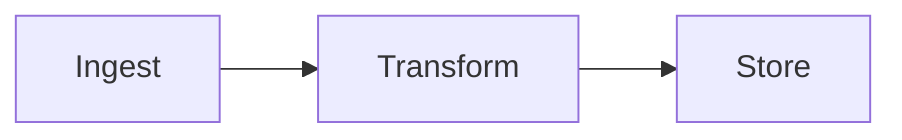

# md2html Report Format Reference

Full details on every feature the renderer supports. Write Markdown that
reads well *as Markdown* — HTML is derived, never hand-authored.

## Frontmatter

| Key | Type | Default | Notes |
|-----|------|---------|-------|
| `title` | string | filename | Report H1 |
| `description` | string | `""` | `<meta description>` |
| `date` | string | today | Shown in footer |
| `author` | string | `""` | |
| `theme` | `auto`\|`light`\|`dark` | `auto` | `auto` = follows viewer preference, toggle always available |
| `toc` | bool | `true` | TOC appears when the doc has 3+ `##`/`###` headings |
| `meta.*` | any | — | Rendered as chips under the title (project, run, version, …) |

Everything under `meta:` becomes a chip. Keep chips short (project, run id,
dataset, version).

## Headings & TOC

- `#` → report title (use at most once; prefer frontmatter `title`).
- `##`, `###` → TOC entries (auto-generated slugs, GitHub-style).
- Deeper levels (`####`) render fine but don't appear in the TOC.

## Tables (GFM)

```markdown
| Metric | A | B |
|--------|---|---|
| AUC    | .81 | .87 |
```

Pipe alignment, bold for winners, right-align numbers with `:---:`. Tables
render with zebra striping, sticky header on scroll, horizontal scroll on
narrow screens.

## Code blocks

Any GitHub language tag works. The Shiki highlighter loads 25 common
languages; unknown tags fall back to `plaintext` (rendered, never broken).
Supported out of the box: `python`, `bash`, `js`, `ts`, `json`, `yaml`,
`toml`, `sql`, `html`, `css`, `md`, `rust`, `go`, `java`, `c`, `cpp`,
`ruby`, `php`, `swift`, `kotlin`, `r`, `dockerfile`, `ini`, `diff`.

```python
import numpy as np
x = np.linspace(0, 10, 100)
```

Dual-theme: the same HTML works in light and dark; no duplication.

## Mermaid diagrams



All Mermaid v12 diagram types: flowchart, sequenceDiagram, classDiagram,
stateDiagram, erDiagram, gantt, pie, mindmap, timeline, journey, gitGraph.
Diagrams re-render on theme toggle (light: `default`, dark: `dark`).

Rules:
- Keep node labels short; long labels break layout.
- One diagram per fenced block; each gets its own card.
- No line breaks inside `[]`/`()`, use `<br/>` for multiline labels.

## XY charts (interactive)

```xy
import numpy as np
import xy

chart = xy.line_chart(
    xy.line([1, 2, 3, 4], [10, 20, 15, 30], color="#4f46e5", width=2.5),
    xy.x_axis(label="day"),
    xy.y_axis(label="seq/s"),
    title="Throughput",
)
```

How it works:
1. The block source is extracted to `xy-src/xy-<hash>.py` (stable hash of
   the source — identical code reuses files across renders).
2. `scripts/xy-export.py` renders it via `xy` (a Python library, Rust core)
   to standalone interactive HTML in `xy-out/` — **light and dark variants**.
3. The report embeds an iframe; the theme toggle swaps the iframe src.

Rules for chart source:
- Bind the chart to a module-level variable named `chart` (also accepted:
  `fig`, `figure`, `c`, or any object exposing `.to_html`).
- Charts must be self-contained: import what they use, inline or derive
  data. The source is executed in an isolated namespace with no access to
  the report's other code.
- Keep runtime under ~30 s. For large data, downsample for the report
  (XY handles 100M+ points, but report figures should stay legible).
- Set `title`, axis labels. Use `xy.theme(...)` only when you need a custom
  palette — otherwise default themes track light/dark automatically.

XY quick API (alpha — check `xy` docs for current surface):

```python
xy.line_chart(xy.line(x, y), xy.x_axis(label="day"), xy.y_axis(label="seq/s"), title="…")
xy.scatter_chart(xy.scatter(x, y, color="#0ea5e9", size=2))
xy.bar_chart(xy.bar(categories, values, color="#4f46e5"))
xy.area_chart(xy.area(x, y, opacity=0.4))
```

The standalone file also has a modebar (XY's default: download/export).
"open" link in each chart card opens it full-window.

## Math (KaTeX)

Block:

```markdown
$$
\mathcal{L}(\theta) = -\sum_{i} y_i \log \hat{y}_i
$$
```

Inline: `$\theta$`. All KaTeX fonts are inlined as data: URIs — no network
requests at view time.

## Alerts / callouts (GFM)

```markdown
> [!NOTE]
> Context.
>
> [!WARNING]
> Caveat.
```

Renders as a left-accent blockquote.

## Images

`` — relative to the Markdown file. Rendered with rounded
corners and border. (The HTML file itself is self-contained; images are
referenced, not inlined.)

## What the renderer does NOT do

- No LaTeX beamer-style slides.
- No client-side JS beyond the fixed template (theme toggle, mermaid, xy
  iframe sync) — the renderer strips nothing and injects nothing into your
  content except theme variables on code.
- Raw HTML passes through (allowDangerousHtml) — use sparingly; prefer
  the built-in constructs above.
